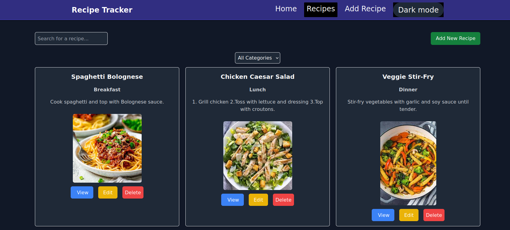
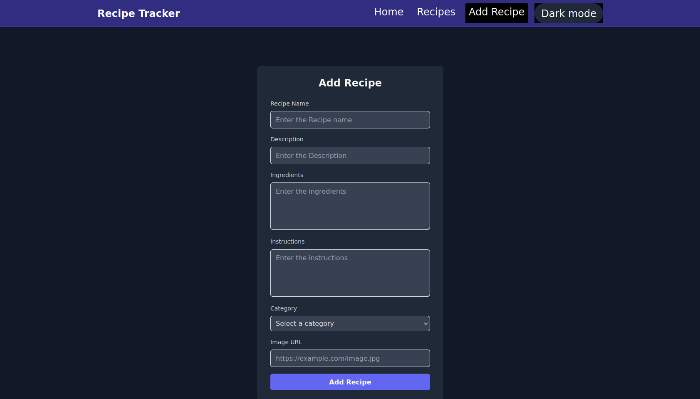

# Recipe Tracker Application

A responsive and user-friendly Recipe Tracker application where users can manage their favorite recipes efficiently.  
This application is built with Vite + React and styled using Tailwind CSS.

## Features

- **Add Recipes**: Users can create new recipes by providing relevant details.
- **View Recipes**: Displays recipes in a clean and responsive grid layout.
- **Edit Recipes**: Users can modify existing recipe details.
- **Delete Recipes**: Remove unwanted recipes with ease.
- **Search Recipes**: Quickly find recipes using keywords.
- **Filter Recipes**: Filter recipes by categories or tags.
- **Featured Recipe**: Displays a random recipe in a "Featured Recipe" section.
- **Dark/Light Mode**: Toggle between dark and light themes for better accessibility and user experience.

## Tech Stack

- **Frontend**: Vite + React
- **Styling**: Tailwind CSS

## Installation and Setup

### Prerequisites

- Node.js
- npm or yarn

### Steps to Run the Application Locally

1. **Clone the repository**:

   ```bash
   git clone https://github.com/Victormuthomi/recipe-tracker
   cd recipe-tracker
   ```

2. **Install dependencies**:

   Using npm:

   ```bash
   npm install
   ```

   Or using yarn:

   ```bash
   yarn install
   ```

3. **Start the development server**:

   Using npm:

   ```bash
   npm run dev
   ```

   Or using yarn:

   ```bash
   yarn dev
   ```

4. **Open the application in your browser** at [http://localhost:5173](http://localhost:5173).

### Building for Production

To build the application for production:

Using npm:

```bash
npm run build

 or

yarn build

The production-ready files will be available in the dist directory.
Preview the Production Build

To preview the production build locally:

npm run preview

or

yarn preview

Project Structure

## License

This project is licensed under the MIT License.




```
