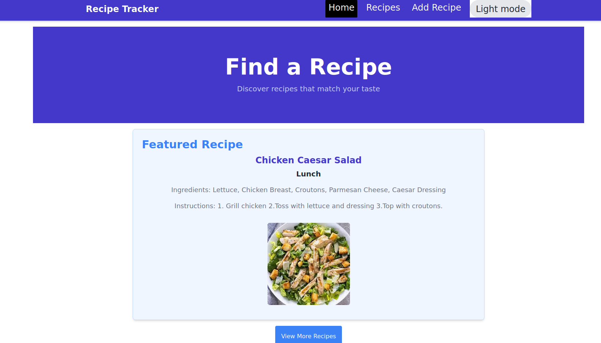

Recipe Tracker Application

A responsive and user-friendly Recipe Tracker application where users can manage their favorite recipes efficiently.
This application is built with Vite + React and styled using Tailwind CSS.
Features

    Add Recipes: Users can create new recipes by providing relevant details.
    View Recipes: Displays recipes in a clean and responsive grid layout.
    Edit Recipes: Users can modify existing recipe details.
    Delete Recipes: Remove unwanted recipes with ease.
    Search Recipes: Quickly find recipes using keywords.
    Filter Recipes: Filter recipes by categories or tags.
    Featured Recipe: Displays a random recipe in a "Featured Recipe" section.
    Dark/Light Mode: Toggle between dark and light themes for better accessibility and user experience.

Tech Stack

    Frontend: Vite + React
    Styling: Tailwind CSS
    State Management: React Context API / useState & useReducer
    Icons: Heroicons for modern and accessible icons
    Deployment: Vite's build system for optimized production builds

Installation and Setup
Prerequisites

    Node.js
    npm or yarn

Steps to Run the Application Locally

    Clone the repository:

git clone <repository_url>
cd recipe-tracker

Install dependencies:

npm install

# or

yarn install

Start the development server:

    npm run dev
    # or
    yarn dev

    Open the application in your browser at http://localhost:5173.

Building for Production

To build the application for production:

npm run build

# or

yarn build

The production-ready files will be available in the dist directory.
Preview the Production Build

To preview the production build locally:

npm run preview

# or

yarn preview

Project Structure

License

This project is licensed under the MIT License.

